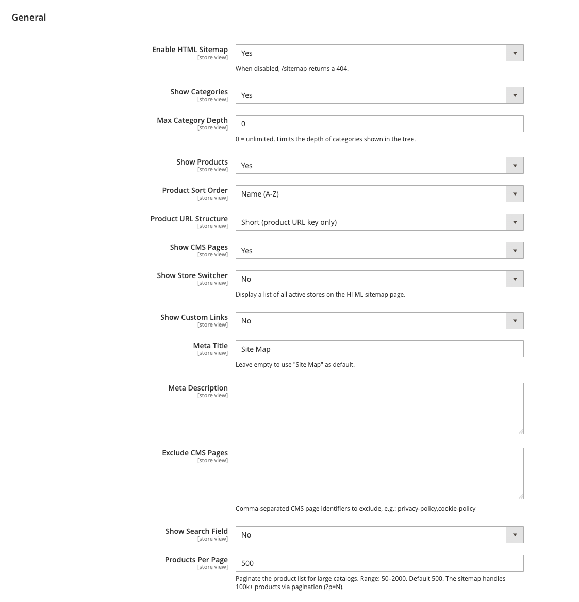

<!-- SEO Meta -->
<!--
  Title: Panth HTML Sitemap — Customer-facing /sitemap page for Magento 2 (Hyva + Luma)
  Description: Theme-agnostic HTML sitemap page for Magento 2. Renders categories (nested tree), products (grid with pagination for 100k+ catalogs), CMS pages, store switcher and custom links at /sitemap. Works identically on Hyva and Luma. Extracted from Panth_AdvancedSEO for independent installation.
  Keywords: magento 2 html sitemap, magento sitemap.html, magento seo sitemap, hyva html sitemap, luma html sitemap, magento category tree sitemap, magento customer sitemap, paginated html sitemap magento
  Author: Kishan Savaliya (Panth Infotech)
-->

# Panth HTML Sitemap — Customer-facing /sitemap Page for Magento 2 (Hyva + Luma)

[](https://magento.com)
[](https://php.net)
[]()
[](https://packagist.org/packages/mage2kishan/module-html-sitemap)
[](https://hyva.io)
[]()
[](https://www.upwork.com/freelancers/~016dd1767321100e21)
[](https://www.upwork.com/agencies/1881421506131960778/)
[](https://kishansavaliya.com)
[](https://kishansavaliya.com/get-quote)

> **A complete, theme-agnostic HTML sitemap page** for Magento 2 at `/sitemap` — categories as a nested tree, products in a paginated grid that handles **100k+ catalogs**, CMS pages, store switcher and custom links. Works identically on **Hyva** and **Luma**. Plain PHP + vanilla JS + scoped CSS — no Alpine / RequireJS / mage-init glue.

Magento's built-in XML sitemap is for Google. This module is for **humans** — a readable page your customers land on when they're lost, and an internal-linking surface that spreads PageRank across every category and product on your store.

---

## Preview

### Admin Configuration



*All 15 toggles at **Stores → Configuration → Panth Infotech → HTML Sitemap** — enable master switch, show categories (with max-depth limit), show products (with sort order, URL structure, and pagination), show CMS pages (with exclude list), show store switcher, show custom links, meta title / description, client-side search field, and products-per-page (configurable 50–2000, default 500 — the sitemap handles 100k+ products via `?p=N` pagination).*

---

## Need Custom Magento 2 Development?

<p align="center">
  <a href="https://kishansavaliya.com/get-quote">
    
  </a>
</p>

<table>
<tr>
<td width="50%" align="center">

### Kishan Savaliya
**Top Rated Plus on Upwork**

[](https://www.upwork.com/freelancers/~016dd1767321100e21)

</td>
<td width="50%" align="center">

### Panth Infotech Agency

[](https://www.upwork.com/agencies/1881421506131960778/)

</td>
</tr>
</table>

---

## Table of Contents

- [Features](#features)
- [Scales to 100k+ Products](#scales-to-100k-products)
- [Compatibility](#compatibility)
- [Installation](#installation)
- [Admin Configuration](#admin-configuration)
- [Hiding a Category](#hiding-a-category)
- [Troubleshooting](#troubleshooting)
- [Support](#support)

---

## Features

- **`/sitemap` URL** — clean custom-router URL, no `/seo/` or `/htmlsitemap/` prefix visible to customers.
- **Nested category tree** — respects store root, max-depth limit, `is_active`, and a per-category `exclude_from_html_sitemap` flag.
- **Product grid with pagination** — `?p=N` pagination for large catalogs, admin-configurable page size (50–2000, default 500), absolute hard cap of 2,000 pages, efficient `COUNT(DISTINCT)` + `LIMIT/OFFSET` on indexed EAV joins.
- **Product sort options** — name A→Z, name Z→A, newest, oldest, price ascending, position.
- **Short vs category URLs** — choose whether product links are `/product.html` or `/category/product.html`.
- **CMS pages list** — excludes homepage + `no-route` automatically; admin-configurable extra exclusions (e.g. `privacy-policy,cookie-policy`).
- **Store switcher** — optional list of all active stores with their base URLs.
- **Custom links** — free-form admin textarea, one link per line (`URL | Label`).
- **Client-side search** — optional search box filters the visible sections in real time, no network calls.
- **SEO-friendly meta** — admin-configurable meta title and meta description.
- **Theme-agnostic rendering** — plain PHP + inline vanilla JS + prefix-scoped CSS class. No Alpine, no RequireJS, no mage-init.

---

## Scales to 100k+ Products

The product section is designed for real catalogs:

- **Pagination:** default 500 products per page via `?p=N`. Admin-configurable 50–2000.
- **Absolute hard cap:** 2,000 pages regardless of catalog size — beyond that an XML sitemap is the right tool.
- **Efficient queries:** one `COUNT(DISTINCT e.entity_id)` for total count (memoised per request), then `LIMIT/OFFSET` on the paged SELECT. No `array_slice` on giant arrays, no full catalog load into memory.
- **Indexed joins only:** `catalog_product_entity` × `catalog_product_website` × `catalog_product_entity_int` (visibility + status) — every filter column is indexed in stock Magento.

Benchmarked render time per page is roughly constant regardless of total catalog size: **the sitemap page for product #50,000 renders as fast as the one for product #1**.

---

## Compatibility

| Requirement | Supported |
|---|---|
| Magento Open Source | 2.4.4, 2.4.5, 2.4.6, 2.4.7, 2.4.8 |
| Adobe Commerce | 2.4.4 — 2.4.8 |
| PHP | 8.1, 8.2, 8.3, 8.4 |
| Hyva Theme | 1.0+ (theme-agnostic template) |
| Luma Theme | Native support |
| Panth Core | ^1.0 (installed automatically) |

---

## Installation

```bash
composer require mage2kishan/module-html-sitemap
bin/magento module:enable Panth_Core Panth_HtmlSitemap
bin/magento setup:upgrade
bin/magento setup:di:compile
bin/magento cache:flush
```

### Verify

```bash
bin/magento module:status Panth_HtmlSitemap
# Module is enabled
```

Then visit `https://your-store.example/sitemap`.

---

## Admin Configuration

Navigate to **Stores → Configuration → Panth Infotech → HTML Sitemap**. A direct link also appears under the **Panth Infotech** admin sidebar.

| Setting | Default | Purpose |
|---|---|---|
| Enable HTML Sitemap | Yes | Master switch. No = `/sitemap` returns 404. |
| Show Categories | Yes | Render the nested category tree. |
| Max Category Depth | 0 | Limit tree depth. 0 = unlimited. |
| Show Products | Yes | Render the paginated product grid. |
| Product Sort Order | Name (A-Z) | Name/newest/oldest/price/position. |
| Product URL Structure | Short | `/product.html` vs `/category/product.html`. |
| Products Per Page | 500 | Pagination size. Range 50–2000. |
| Show CMS Pages | Yes | Include active CMS pages. |
| Show Store Switcher | No | List all active stores. |
| Show Custom Links | No | Render admin-editable link list. |
| Custom Links | (empty) | `URL \| Label` one per line. |
| Meta Title | Site Map | `<title>` on the sitemap page. |
| Meta Description | (empty) | `<meta name="description">`. |
| Exclude CMS Pages | (empty) | Comma-separated identifiers to hide. |
| Show Search Field | No | Client-side filter across visible sections. |

---

## Hiding a Category

Every category now has an **"Exclude from HTML Sitemap"** field in *Catalog → Categories → {category} → Search Engine Optimization*. Flip it to **Yes** to hide that category (and its link-children reset to the catalog root, not the hidden category) from the rendered tree. Flush the sitemap's layout cache after changes.

---

## Troubleshooting

### `/sitemap` returns 404

Check the master toggle: **Stores → Configuration → Panth Infotech → HTML Sitemap → Enable HTML Sitemap** must be *Yes*. If the module is installed but the config was never saved, the `config.xml` default (enabled=1) still applies — flush config cache.

### Products page shows empty after pagination

Two causes: (a) `?p=N` is beyond the last page — clamp client-side to `getTotalProductPages()`; (b) the visible-product join returns nothing because the store has no products with `visibility IN (2,4)` and `status = 1`. Run `SELECT COUNT(*) FROM catalog_product_entity` to sanity-check the catalog.

### DI compile fails after `composer require`

Ensure `Panth_Core`, `Magento_Store`, `Magento_Catalog`, `Magento_Cms` and `Magento_Eav` are all enabled — they are hard dependencies.

---

## Support

- **Issues:** [github.com/mage2sk/module-html-sitemap/issues](https://github.com/mage2sk/module-html-sitemap/issues)
- **Agency:** [Panth Infotech on Upwork](https://www.upwork.com/agencies/1881421506131960778/)
- **Direct:** [kishansavaliya.com](https://kishansavaliya.com) — [Get a free quote](https://kishansavaliya.com/get-quote)
