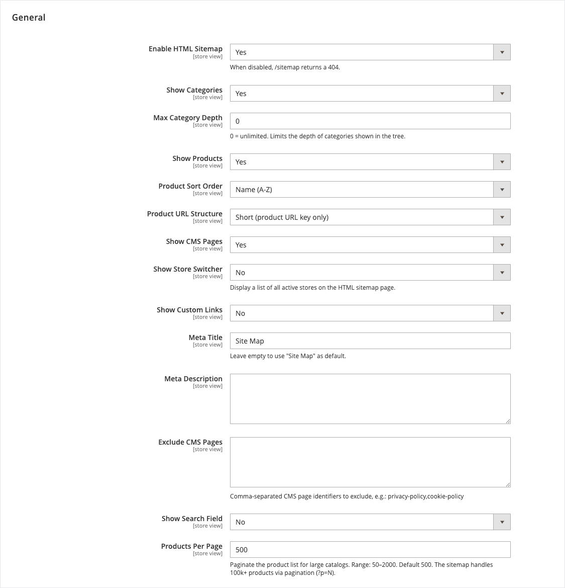
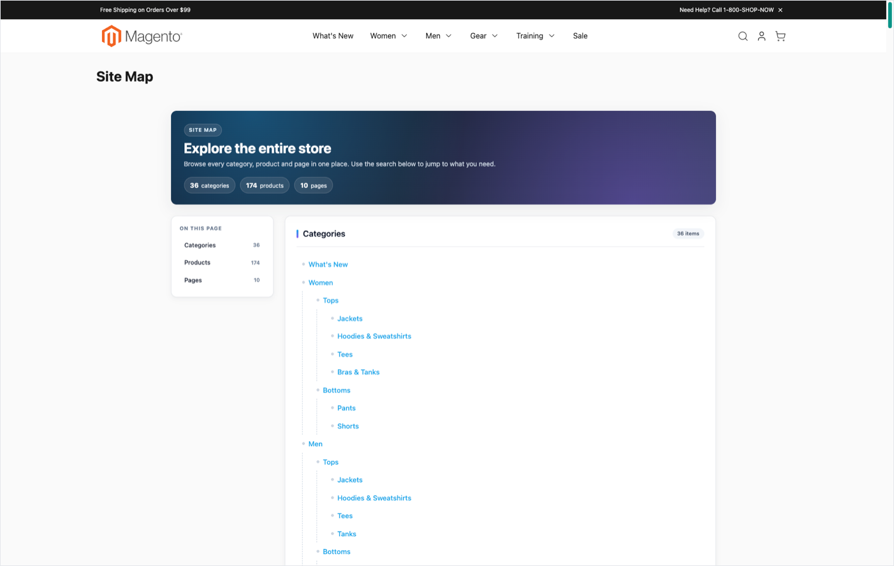
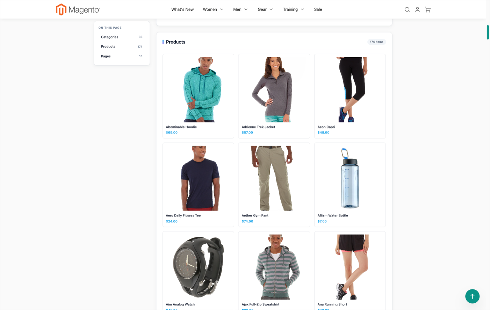
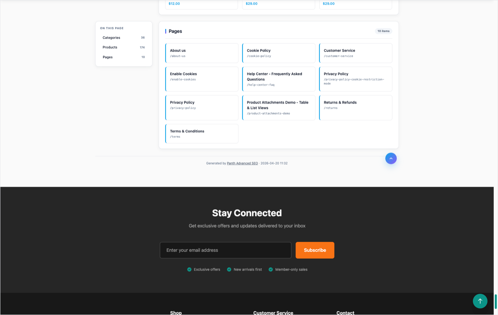
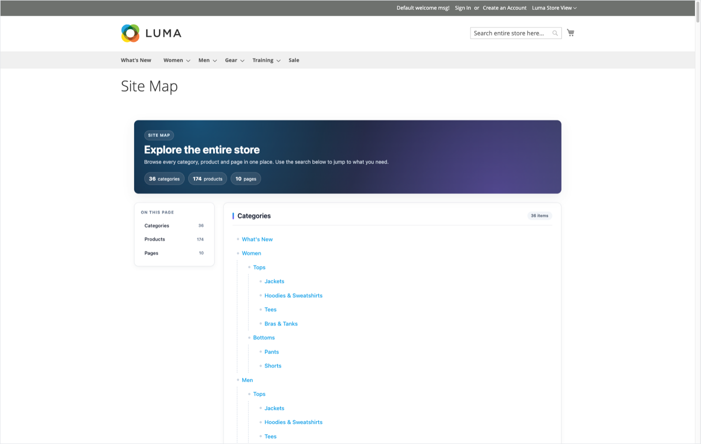
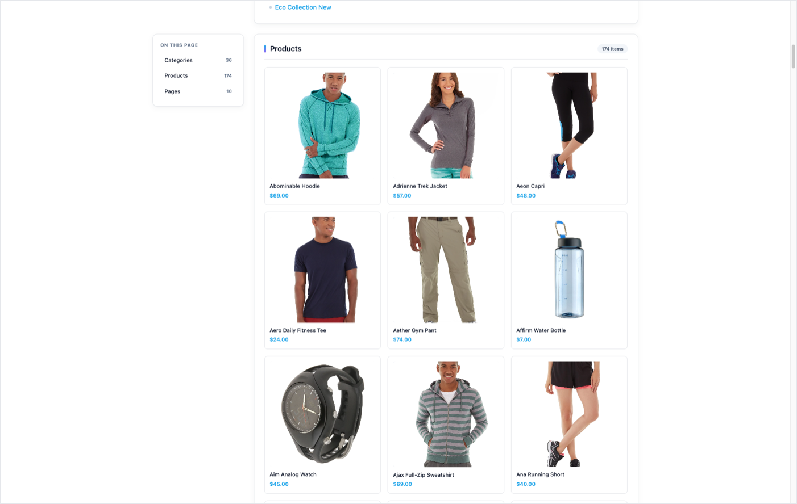
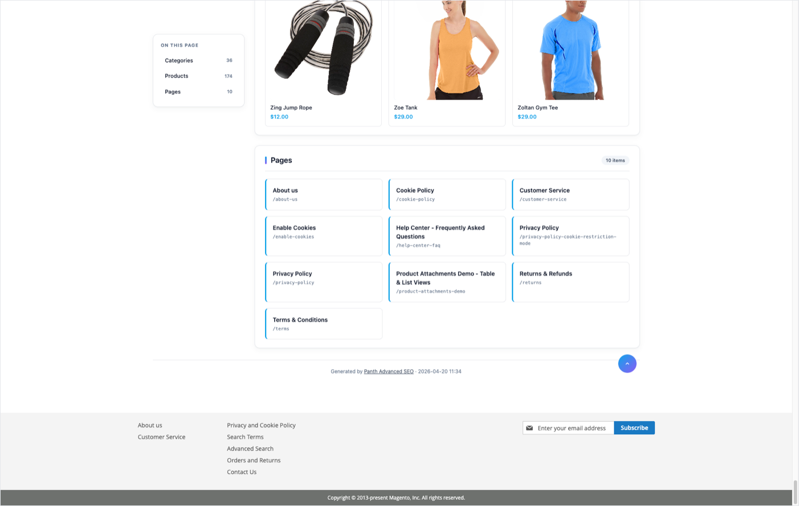

<!-- SEO Meta -->
<!--
  Title: Magento 2 HTML Sitemap Extension: Customer-Facing /sitemap Page for Hyva and Luma | Panth Infotech
  Description: Panth HTML Sitemap adds a clean /sitemap page to Magento 2 with a nested category tree, paginated product grid (handles 100k+ catalogs), CMS pages, store switcher, and custom links. Works identically on Hyva and Luma. Theme-agnostic plain PHP rendering with no Alpine or RequireJS dependency. Built by Top Rated Plus Magento developer Kishan Savaliya.
  Keywords: magento 2 html sitemap, magento 2 html sitemap extension, magento 2 sitemap page, magento sitemap.html, hyva html sitemap, luma html sitemap, magento 2 category tree sitemap, magento 2 customer sitemap, paginated html sitemap magento, magento 2 seo sitemap page, magento 2 sitemap module
  Author: Kishan Savaliya (Panth Infotech)
  Canonical: https://kishansavaliya.com/magento-2-html-sitemap.html
-->

# Magento 2 HTML Sitemap Extension: Customer-Facing /sitemap Page for Hyva and Luma

[](https://magento.com)
[](https://php.net)
[](https://www.hyva.io)
[](https://kishansavaliya.com/magento-2-html-sitemap.html)
[](https://packagist.org/packages/mage2kishan/module-html-sitemap)
[](https://www.upwork.com/freelancers/~016dd1767321100e21)
[](https://kishansavaliya.com)

> **Add a clean, human-readable sitemap page to your Magento 2 store at `/sitemap`.** Panth HTML Sitemap renders categories as a nested tree, products in a paginated grid that handles catalogs of 100k+ items, CMS pages, an optional store switcher, and custom admin-defined links. The rendering is plain PHP with no Alpine or RequireJS dependency, so it works identically on **Hyva** and **Luma**.

**Product page:** [kishansavaliya.com/magento-2-html-sitemap.html](https://kishansavaliya.com/magento-2-html-sitemap.html)

---

## Quick Answer

**What is Panth HTML Sitemap?** It is a Magento 2 extension that creates a clean `/sitemap` page for your customers, showing all categories, products, and CMS pages in one place so shoppers can find what they need and search engines can crawl every link.

**What does it add to my store?**

- A **`/sitemap` page** with a nested category tree, paginated product grid, CMS pages list, optional store switcher, and optional custom links.
- **Admin configuration** under Stores with 17 settings including sort order, pagination size, meta title, meta description, and per-section toggles.
- A **per-category exclude flag** so you can hide individual categories from the tree without editing configuration files.
- **Optional integrations** with Panth_Testimonials, Panth_Faq, and Panth_DynamicForms that show those sections when those modules are installed.

**Which themes are supported?** Both **Hyva** and **Luma**. The template is plain PHP with vanilla JS and scoped CSS, so neither Alpine nor RequireJS is needed.

**What does it need?** Magento 2.4.4 to 2.4.8, PHP 8.1 to 8.4, and the free `mage2kishan/module-core` package.

---

## Need Custom Magento 2 Development?

> **Get a free quote for your project in 24 hours** for custom modules, Hyva themes, performance work, M1 to M2 migrations, and Adobe Commerce Cloud.

<p align="center">
  <a href="https://kishansavaliya.com/get-quote">
    
  </a>
</p>

<table>
<tr>
<td width="50%" align="center">

### Kishan Savaliya
**Top Rated Plus on Upwork**

[](https://www.upwork.com/freelancers/~016dd1767321100e21)

100% Job Success • 10+ Years Magento Experience
Adobe Certified • Hyva Specialist

</td>
<td width="50%" align="center">

### Panth Infotech Agency
**Magento Development Team**

[](https://www.upwork.com/agencies/1881421506131960778/)

Custom Modules • Theme Design • Migrations
Performance • SEO • Adobe Commerce Cloud

</td>
</tr>
</table>

**Visit our website:** [kishansavaliya.com](https://kishansavaliya.com) &nbsp;|&nbsp; **Get a quote:** [kishansavaliya.com/get-quote](https://kishansavaliya.com/get-quote)

---

## Table of Contents

- [Who Is It For](#who-is-it-for)
- [Key Features](#key-features)
- [Compatibility](#compatibility)
- [Installation](#installation)
- [Configuration](#configuration)
- [How It Works](#how-it-works)
- [Hiding a Category](#hiding-a-category)
- [Scales to 100k+ Products](#scales-to-100k-products)
- [FAQ](#faq)
- [Support](#support)
- [About Panth Infotech](#about-panth-infotech)
- [Quick Links](#quick-links)

---

## Who Is It For

- **Merchants with large catalogs** who want customers to browse every category and product without relying only on the search bar.
- **SEO-focused stores** that want a single human-readable page to spread internal links across the full catalog and CMS content.
- **Hyva storefronts** that need a sitemap page built without Alpine or RequireJS so it fits the Hyva stack cleanly.
- **Multi-store setups** where different store views need different sitemap configurations at the store-view scope.
- **Store owners** who want to control exactly which categories, products, and pages appear on the sitemap without editing templates.

---

## Key Features

### Customer-Facing Sitemap at /sitemap
- **Clean custom-router URL** at `/sitemap` with no `/seo/` or `/htmlsitemap/` prefix visible to customers.
- **Nested category tree** that respects the store root, a configurable max-depth limit, the `is_active` flag, and a per-category exclude flag.
- **Paginated product grid** with `?p=N` pagination so large catalogs load fast. Admin-configurable page size from 50 to 2000, default 500.
- **Product sort options**: name A to Z, name Z to A, newest, oldest, price ascending, position.
- **Short or category URLs** for products, configurable per store view.
- **CMS pages list** with automatic exclusion of the homepage and `no-route`. Extra exclusions are configurable with a comma-separated list.

### Admin Controls
- **17 configuration settings** under Stores -> Configuration -> Panth Extensions -> HTML Sitemap.
- **Store switcher section** that lists all active stores with their base URLs, shown when enabled.
- **Custom links section** with a free-form textarea, one link per line in `URL | Label` format.
- **Meta title and meta description** fields so the sitemap page has the right SEO metadata.
- **Client-side search field** that filters visible sections in real time with no network calls.

### Optional Integrations
- **Panth_Testimonials** section shown on the sitemap when that module is installed.
- **Panth_Faq** section shown when Panth_Faq is installed.
- **Panth_DynamicForms** pages section shown when that module is installed and forms with `form_type = page` exist.
- All optional integrations use table-existence guards and add nothing if the module is not present.

### Hyva + Luma Ready
- **Theme-agnostic template** built in plain PHP with vanilla JS and prefix-scoped CSS (`.panth-htmlsitemap`).
- **No Alpine, no RequireJS, no mage-init** required, so the same rendering logic works under both Hyva's Tailwind stack and Luma's RequireJS layer.
- **Scoped stylesheet** so nothing leaks into the theme's CSS bundle.

### Built to Last
- **Clean MEQP-style code** with constructor dependency injection only.
- **Full Page Cache friendly** because the sitemap page renders server-side with no uncacheable AJAX calls.
- **Translation ready**, every label uses Magento's `__()` function.
- **Multi-store scope** for all configuration settings at default, website, and store view level.

---

## Compatibility

| Requirement | Versions Supported |
|---|---|
| Magento Open Source | 2.4.4, 2.4.5, 2.4.6, 2.4.7, 2.4.8 |
| Adobe Commerce | 2.4.4, 2.4.5, 2.4.6, 2.4.7, 2.4.8 |
| Adobe Commerce Cloud | 2.4.4 to 2.4.8 |
| PHP | 8.1.x, 8.2.x, 8.3.x, 8.4.x |
| Hyva Theme | 1.0+ (theme-agnostic template) |
| Luma Theme | Native support |
| Required Dependency | `mage2kishan/module-core` (free) |

---

## Installation

### Composer Installation (Recommended)

```bash
composer require mage2kishan/module-html-sitemap
bin/magento module:enable Panth_Core Panth_HtmlSitemap
bin/magento setup:upgrade
bin/magento setup:di:compile
bin/magento setup:static-content:deploy -f
bin/magento cache:flush
```

### Manual Installation via ZIP

1. Download the latest release from [Packagist](https://packagist.org/packages/mage2kishan/module-html-sitemap) or from the [product page](https://kishansavaliya.com/magento-2-html-sitemap.html).
2. Extract it to `app/code/Panth/HtmlSitemap/` in your Magento install.
3. Make sure `Panth_Core` is installed too (required dependency).
4. Run the commands above starting from `bin/magento module:enable`.

### Verify Installation

```bash
bin/magento module:status Panth_HtmlSitemap
# Expected: Module is enabled
```

After install, visit `https://your-store.example/sitemap` and open:
```
Admin -> Stores -> Configuration -> Panth Extensions -> HTML Sitemap
```

---

## Configuration

Go to **Stores -> Configuration -> Panth Extensions -> HTML Sitemap** (or use the direct link under the **Panth Infotech** admin sidebar menu).

| Setting | Group | Default | Description |
|---|---|---|---|
| Enable HTML Sitemap | General | Yes | Master toggle. When disabled, `/sitemap` returns a 404. |
| Show Categories | General | Yes | Render the nested category tree. |
| Max Category Depth | General | 0 | Limit tree depth. 0 means unlimited. |
| Show Products | General | Yes | Render the paginated product grid. |
| Product Sort Order | General | Name (A-Z) | Name A-Z, Name Z-A, Newest, Oldest, Price, Position. |
| Product URL Structure | General | Short | Short (`/product.html`) or with category prefix. |
| Products Per Page | General | 500 | Pagination size. Range 50 to 2000. |
| Show CMS Pages | General | Yes | Include active CMS pages (homepage and no-route excluded automatically). |
| Exclude CMS Pages | General | (empty) | Comma-separated CMS page identifiers to hide, e.g. `privacy-policy,cookie-policy`. |
| Show Store Switcher | General | No | List all active stores with their base URLs. |
| Show Testimonials | General | No | Show Panth_Testimonials section if that module is installed. |
| Show FAQs | General | No | Show Panth_Faq section if that module is installed. |
| Show Dynamic Forms | General | No | Show Panth_DynamicForms pages if that module is installed. |
| Show Custom Links | General | No | Render an admin-editable list of links. |
| Custom Links | General | (empty) | One link per line in `URL \| Label` format. |
| Meta Title | General | Site Map | `<title>` on the sitemap page. |
| Meta Description | General | (empty) | `<meta name="description">` for the sitemap page. |
| Show Search Field | General | No | Client-side filter field that narrows visible sections in real time. |

---

## How It Works

1. A **custom router** catches requests to `/sitemap` and forwards them to the sitemap controller.
2. The controller reads configuration and builds the page sections: category tree, product grid, CMS pages, optional integrations, store switcher, and custom links.
3. For the **product grid**, the underlying SQL uses `LIMIT/OFFSET` on indexed EAV joins with a single `COUNT(DISTINCT)` for the total. This keeps render time roughly constant regardless of catalog size.
4. The template is **plain PHP** with inline vanilla JS and a scoped stylesheet. No Alpine component, no RequireJS define, no mage-init attribute is needed, so Hyva and Luma render the same output.
5. **Pagination** happens via `?p=N` query parameter. The module enforces a hard cap of 2,000 pages to prevent runaway URLs.
6. **Meta title and description** are injected into the page head from the admin configuration fields.

---

## Hiding a Category

Every category has an **"Exclude from HTML Sitemap"** field at **Catalog -> Categories -> {category} -> Search Engine Optimization**. Set it to **Yes** to hide that category from the rendered tree. Flush the sitemap layout cache after making changes.

---

## Scales to 100k+ Products

The product section is designed for real catalogs:

- **Pagination:** default 500 products per page via `?p=N`. Admin-configurable 50 to 2000.
- **Absolute hard cap:** 2,000 pages regardless of catalog size. Beyond that an XML sitemap is the right tool.
- **Efficient queries:** one `COUNT(DISTINCT e.entity_id)` for the total count (memoised per request), then `LIMIT/OFFSET` on the paged SELECT. No full catalog load into memory.
- **Indexed joins only:** `catalog_product_entity` joined with `catalog_product_website` and `catalog_product_entity_int` (visibility and status). Every filter column is indexed in stock Magento.

Benchmarked render time per page is roughly constant regardless of total catalog size: the sitemap page for product 50,000 renders as fast as the one for product 1.

---

## Preview

### Admin Configuration



*All settings at **Stores -> Configuration -> Panth Infotech -> HTML Sitemap** including the master switch, category tree controls, product grid controls, CMS pages, optional integrations, store switcher, custom links, meta fields, and the client-side search toggle.*

---

### Frontend - Hyva Theme

<table>
<tr>
<td width="33%" align="center"><b>Hero + Categories tree</b></td>
<td width="33%" align="center"><b>Product grid</b></td>
<td width="33%" align="center"><b>CMS pages</b></td>
</tr>
<tr>
<td><a href="docs/hyva-hero.png"></a></td>
<td><a href="docs/hyva-products.png"></a></td>
<td><a href="docs/hyva-pages.png"></a></td>
</tr>
</table>

*Native Hyva styling with a gradient hero showing live counts, a sticky "On this page" sidebar, and a scoped stylesheet so nothing leaks into the Tailwind bundle.*

---

### Frontend - Luma Theme

<table>
<tr>
<td width="33%" align="center"><b>Hero + Categories tree</b></td>
<td width="33%" align="center"><b>Product grid</b></td>
<td width="33%" align="center"><b>CMS pages</b></td>
</tr>
<tr>
<td><a href="docs/luma-hero.png"></a></td>
<td><a href="docs/luma-products.png"></a></td>
<td><a href="docs/luma-pages.png"></a></td>
</tr>
</table>

*Identical markup on Luma. The same plain PHP template produces the same output under Luma's RequireJS layer without any theme-specific overrides.*

---

## FAQ

### Does it work on Hyva themes without Alpine.js?
Yes. The template is plain PHP with vanilla JS and prefix-scoped CSS. It has no Alpine component, no RequireJS define, and no mage-init attributes, so it loads and works the same way on both Hyva and Luma.

### Does it work with an enforced Content-Security-Policy?
Yes. The template has no inline event handlers; the Print button, search filter and thumbnail fallback are bound from the page's single script block. On Hyva that block is registered through Hyva's CSP helper and receives a nonce or hash when `'unsafe-inline'` is disabled. Luma has no nonce mechanism of its own, so a Luma store still needs `'unsafe-inline'` for script blocks, as it does for Magento's own templates.

### How does the module handle large catalogs?
The product section paginates via `?p=N`. The default page size is 500 products. The underlying SQL uses `LIMIT/OFFSET` on indexed EAV joins and a single memoised `COUNT(DISTINCT)` query, so render time stays roughly constant no matter how many products are in the store. A hard cap of 2,000 pages prevents runaway URLs.

### Can I hide specific categories from the sitemap?
Yes. Each category has an "Exclude from HTML Sitemap" field under its SEO tab in the admin. Set it to Yes and flush cache. There is no need to edit configuration or templates.

### Can I hide specific CMS pages?
Yes. The "Exclude CMS Pages" field takes a comma-separated list of CMS page identifiers. The homepage and `no-route` page are excluded automatically.

### Does it support multi-store setups?
Yes. All configuration settings are available at default, website, and store view scope, so each store view can have its own sitemap settings.

### Does the `/sitemap` URL conflict with Magento's XML sitemap?
No. Magento's built-in XML sitemap is served at the path you configure (usually `/sitemap.xml`). This module serves a human-readable HTML page at `/sitemap`. They are separate routes and do not interfere.

### What optional integrations are available?
The module can show Testimonials, FAQ entries, and Dynamic Form pages on the sitemap if you have the Panth_Testimonials, Panth_Faq, or Panth_DynamicForms modules installed. Each integration uses a table-existence guard, so nothing breaks if those modules are absent.

### Does it need Panth Core?
Yes. `mage2kishan/module-core` is a free required dependency. Composer installs it automatically.

### Is it translation ready?
Yes. Every label uses Magento's `__()` function, so you can translate from a theme or language pack.

---

## Support

| Channel | Contact |
|---|---|
| Product Page | [kishansavaliya.com/magento-2-html-sitemap.html](https://kishansavaliya.com/magento-2-html-sitemap.html) |
| Email | kishansavaliyakb@gmail.com |
| Website | [kishansavaliya.com](https://kishansavaliya.com) |
| WhatsApp | +91 84012 70422 |
| GitHub Issues | [github.com/mage2sk/module-html-sitemap/issues](https://github.com/mage2sk/module-html-sitemap/issues) |
| Upwork (Top Rated Plus) | [Hire Kishan Savaliya](https://www.upwork.com/freelancers/~016dd1767321100e21) |
| Upwork Agency | [Panth Infotech](https://www.upwork.com/agencies/1881421506131960778/) |

Response time: 1-2 business days.

### Need Custom Magento Development?

Looking for **custom Magento module development**, **Hyva theme work**, **store migrations**, or **performance tuning**? Get a free quote in 24 hours:

<p align="center">
  <a href="https://kishansavaliya.com/get-quote">
    
  </a>
</p>

<p align="center">
  <a href="https://www.upwork.com/freelancers/~016dd1767321100e21">
    
  </a>
  &nbsp;&nbsp;
  <a href="https://www.upwork.com/agencies/1881421506131960778/">
    
  </a>
  &nbsp;&nbsp;
  <a href="https://kishansavaliya.com/magento-2-html-sitemap.html">
    
  </a>
</p>

---

## About Panth Infotech

Built and maintained by **Kishan Savaliya** ([kishansavaliya.com](https://kishansavaliya.com)), a **Top Rated Plus** Magento developer on Upwork with 10+ years of eCommerce experience.

**Panth Infotech** is a Magento 2 development agency that builds high quality, security focused extensions and themes for both Hyva and Luma storefronts. The extension suite covers SEO, performance, checkout, product presentation, customer engagement, and store management, with each module built to MEQP standards and tested across Magento 2.4.4 to 2.4.8.

Browse the full extension catalog on our [Magento extensions page](https://kishansavaliya.com/magento-extensions.html) or on [Packagist](https://packagist.org/packages/mage2kishan/).

---

## Quick Links

| Resource | Link |
|---|---|
| **Product Page** | [magento-2-html-sitemap.html](https://kishansavaliya.com/magento-2-html-sitemap.html) |
| **Packagist** | [mage2kishan/module-html-sitemap](https://packagist.org/packages/mage2kishan/module-html-sitemap) |
| **GitHub** | [mage2sk/module-html-sitemap](https://github.com/mage2sk/module-html-sitemap) |
| **Website** | [kishansavaliya.com](https://kishansavaliya.com) |
| **Free Quote** | [kishansavaliya.com/get-quote](https://kishansavaliya.com/get-quote) |
| **Upwork (Top Rated Plus)** | [Hire Kishan Savaliya](https://www.upwork.com/freelancers/~016dd1767321100e21) |
| **Upwork Agency** | [Panth Infotech](https://www.upwork.com/agencies/1881421506131960778/) |
| **Email** | kishansavaliyakb@gmail.com |
| **WhatsApp** | +91 84012 70422 |

---

<p align="center">
  <strong>Ready to give your customers a fast way to find anything in your store?</strong><br/>
  <a href="https://kishansavaliya.com/magento-2-html-sitemap.html">
    
  </a>
</p>

---

**SEO Keywords:** magento 2 html sitemap, magento 2 html sitemap extension, magento 2 html sitemap module, magento 2 sitemap page, magento sitemap.html, magento 2 customer sitemap, hyva html sitemap, hyva sitemap extension, luma html sitemap, magento 2 category tree sitemap, magento 2 paginated sitemap, magento 2 seo sitemap page, magento 2 human readable sitemap, magento 2 sitemap with categories, magento 2 sitemap with products, magento 2 cms pages sitemap, magento 2 custom links sitemap, magento 2 store switcher sitemap, magento 2.4.8 html sitemap, php 8.4 html sitemap, mage2kishan html sitemap, panth html sitemap, panth infotech, hire magento developer, top rated plus upwork, kishan savaliya magento, custom magento development
