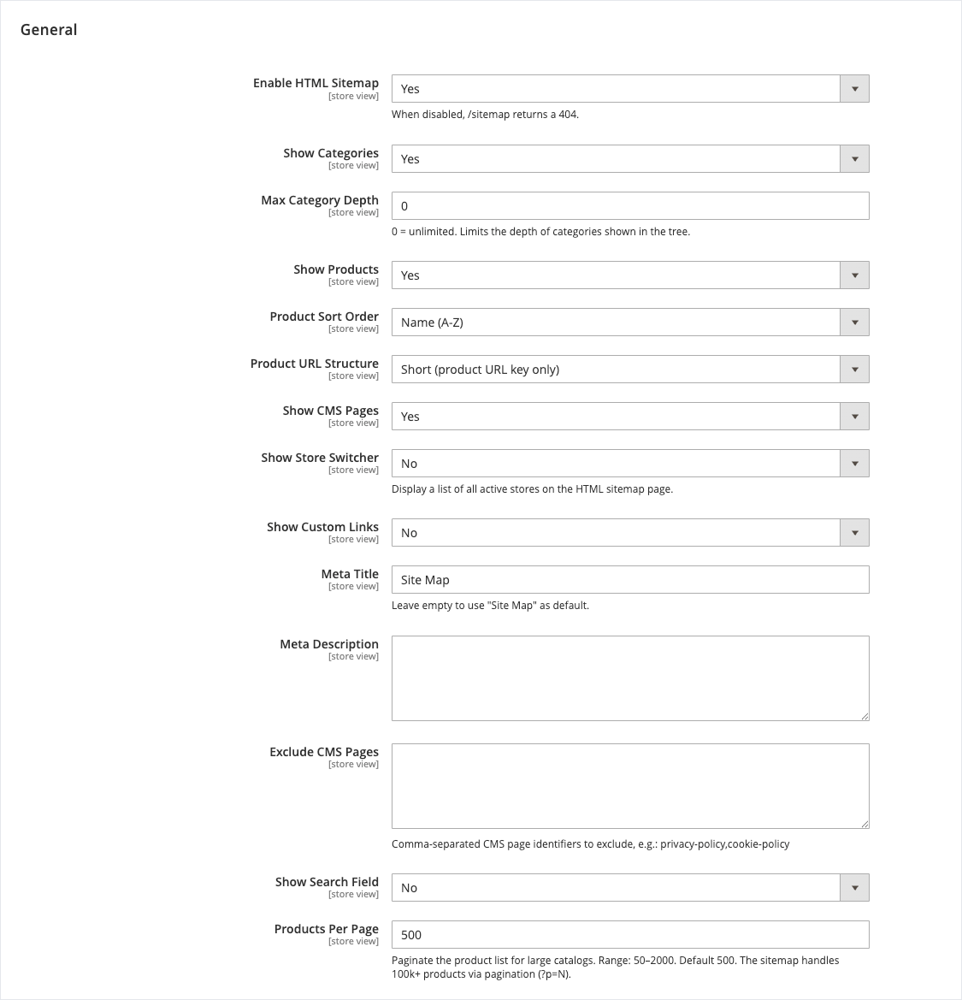
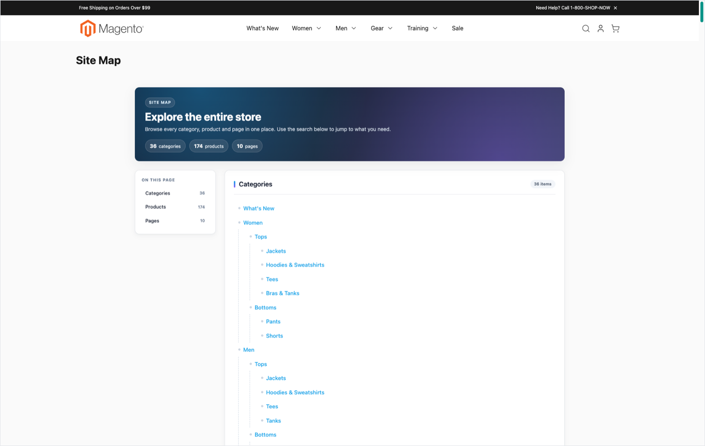
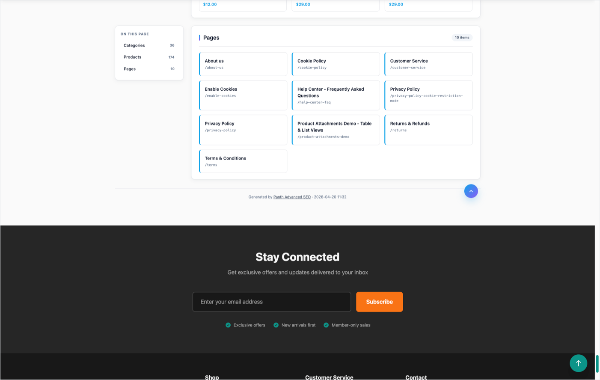
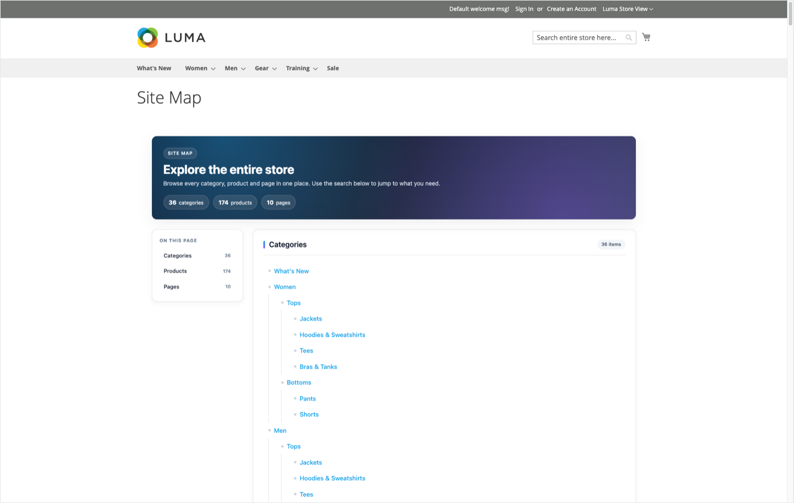
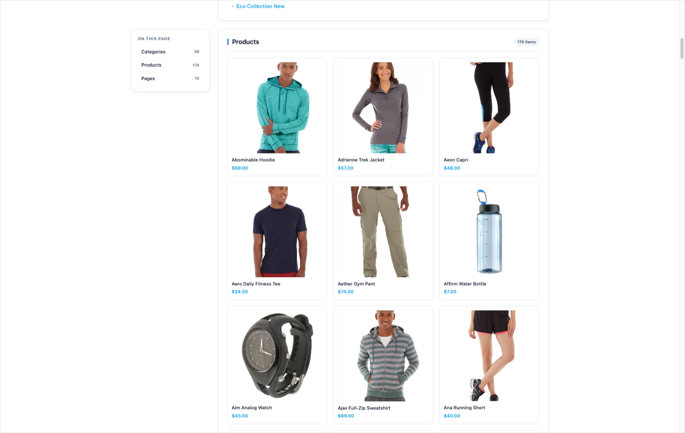
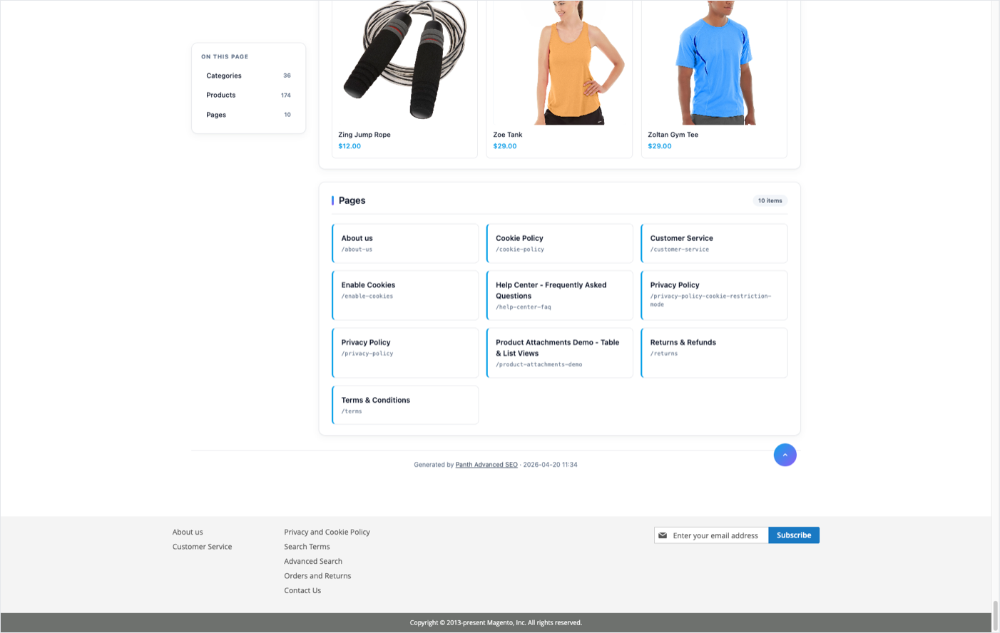

# Magento 2 HTML Sitemap

Panth HTML Sitemap adds a human-readable sitemap page to a Magento 2 store at `/sitemap`. The page lists the category tree of the current store view, a paginated grid of enabled and visible products, active CMS pages, an optional list of store views, optional custom links, and, when the related Panth modules are installed, testimonials, FAQ entries and dynamic form pages. All content is read directly from the database and rendered server-side by a single template.

The module registers a custom router so the page is served at `/sitemap` without a module front name, adds a configuration section under Panth Extensions, and adds an "Exclude from HTML Sitemap" attribute to categories. It is intended for store owners who want a browsable overview of the catalogue and content for shoppers and crawlers. The template is plain PHP with a small vanilla JavaScript block and scoped CSS, so it renders the same on Hyva and Luma themes.

Product page: [kishansavaliya.com/magento-2-html-sitemap.html](https://kishansavaliya.com/magento-2-html-sitemap.html)

## Features

- Sitemap page served at `/sitemap` through a custom router; the same page is also reachable at `/htmlsitemap/index/index`.
- Nested category tree limited to the store root category, active categories only, with an optional maximum depth.
- Per-category "Exclude from HTML Sitemap" attribute (Search Engine Optimization group) added by a data patch.
- Paginated product grid with page links (`?p=N`) showing the product name, small image thumbnail and price for products that are enabled, assigned to the current website and visible in catalogue or catalogue and search.
- Product sort order: name A-Z, name Z-A, newest, oldest, price low to high, position.
- Product URL structure: short product URL or category path URL, taken from the `url_rewrite` table.
- Products per page configurable between 50 and 2000 (default 500); the number of product pages is capped at 2000.
- CMS pages list of active pages assigned to the store, excluding the configured home page, `no-route` and any identifiers listed in the configuration.
- Optional list of active store views with their base URLs.
- Optional custom links entered in the admin as `URL | Label`, one per line.
- Optional sections for Panth_Testimonials, Panth_Faq and Panth_DynamicForms; each checks whether the source tables exist and renders nothing when the module is absent.
- Optional client-side search field that filters the rendered sections in the browser without further requests.
- Configurable meta title (default "Site Map") and meta description for the page.
- Summary counts, an "On this page" section list, a print button with a print stylesheet, a back-to-top button and a placeholder for missing or broken product thumbnails.
- No inline event handlers in the template; on Hyva the inline script block is registered through the theme's CSP helper when it is available.
- All settings can be set at default, website and store view scope.
- Data-reading failures are logged and the affected section is rendered empty rather than breaking the page.

## Compatibility

| Platform | Versions |
|---|---|
| Magento Open Source | 2.4.4 to 2.4.8 (as published on the product page) |
| Adobe Commerce | 2.4.4 to 2.4.8 (as published on the product page) |
| PHP | 8.1, 8.2, 8.3, 8.4 (from `composer.json`) |
| Themes | Hyva, Luma |

Composer constraints for Magento packages: `magento/framework ^103.0`, `magento/module-store ^101.0`, `magento/module-catalog ^104.0`, `magento/module-cms ^104.0`, `magento/module-eav ^102.0`.

## Requirements

- Magento Open Source or Adobe Commerce 2.4.4 to 2.4.8
- PHP `~8.1.0 || ~8.2.0 || ~8.3.0 || ~8.4.0`
- `mage2kishan/module-core` `^1.0` (Panth_Core; provides the Panth Extensions configuration tab and admin menu)
- Magento modules `Magento_Store`, `Magento_Catalog`, `Magento_Cms` and `Magento_Eav` (part of every standard installation)

Optional, only for the extra sections: Panth_Testimonials, Panth_Faq, Panth_DynamicForms. They are not required by `composer.json`.

## Installation

```bash
composer require mage2kishan/module-html-sitemap
bin/magento module:enable Panth_Core Panth_HtmlSitemap
bin/magento setup:upgrade
bin/magento setup:di:compile
bin/magento cache:flush
```

`setup:di:compile` is only needed in production mode. The module ships no files under `view/*/web`, so a static content deploy is not required for it.

Check that the module is enabled:

```bash
bin/magento module:status Panth_HtmlSitemap
```

`setup:upgrade` runs the data patch that adds the `exclude_from_html_sitemap` category attribute.

## Configuration

Admin path: Stores > Configuration > Panth Extensions > HTML Sitemap. The Panth Extensions admin menu (provided by Panth_Core) also has an "HTML Sitemap" entry that opens the same section. Access is controlled by the ACL resource `Panth_HtmlSitemap::config`.

All settings are in one group, General, under the config path `panth_html_sitemap/general/`. Every field except "Enable HTML Sitemap" is shown only while the module is enabled.

| Setting | Default | What it does |
|---|---|---|
| Enable HTML Sitemap (`enabled`) | Yes | Master switch. When disabled the router does not match `/sitemap` and the controller forwards to the 404 page. |
| Show Categories (`show_categories`) | Yes | Renders the category tree. |
| Max Category Depth (`max_category_depth`) | 0 | Maximum depth of the tree below the store root category; 0 means unlimited. Shown when categories are enabled. |
| Show Products (`show_products`) | Yes | Renders the product grid. |
| Product Sort Order (`product_sort_order`) | Name (A-Z) | Name (A-Z), Name (Z-A), Newest, Oldest, Price (low to high) or Position. Shown when products are enabled. |
| Product URL Structure (`product_url_structure`) | Short | Short (product URL key only) or With Categories (category/product). Shown when products are enabled. |
| Show CMS Pages (`show_cms_pages`) | Yes | Renders the CMS pages list. |
| Show Store Switcher (`show_stores`) | No | Lists all active store views with their base URLs. |
| Show Testimonials (`show_testimonials`) | Yes | Renders the testimonials section when Panth_Testimonials is installed; otherwise nothing is rendered. |
| Show FAQs (`show_faqs`) | Yes | Renders the FAQ section when Panth_Faq is installed; otherwise nothing is rendered. |
| Show Dynamic Forms (`show_dynamic_forms`) | Yes | Renders the forms section when Panth_DynamicForms is installed and at least one form has form type page or both; otherwise nothing is rendered. |
| Show Custom Links (`show_custom_links`) | No | Renders the custom links section. |
| Custom Links (`custom_links`) | empty | One link per line in the form `URL \| Label`. When no label is given the URL is used as the label. Shown when custom links are enabled. |
| Meta Title (`meta_title`) | Site Map | Page title of the sitemap page. When left empty, "Site Map" is used. |
| Meta Description (`meta_description`) | empty | Meta description of the sitemap page. |
| Exclude CMS Pages (`exclude_cms_pages`) | empty | Comma-separated CMS page identifiers to leave out, for example `privacy-policy,cookie-policy`. Shown when CMS pages are enabled. |
| Show Search Field (`show_search_field`) | No | Adds a search field that filters the rendered sections in the browser. |
| Products Per Page (`products_per_page`) | 500 | Number of products per page. Values are clamped to the range 50 to 2000. Shown when products are enabled. |

Default behaviour after installation: the page is enabled and shows categories, products (500 per page, sorted by name, short URLs) and CMS pages. The store switcher, custom links and search field are off. The three optional integration toggles are on but only render when the matching module is installed.

## Usage

### Storefront page

The sitemap is served at `<store base URL>/sitemap`. The path must be exactly `sitemap`; the router does not match `sitemap.xml` or other paths, so Magento's XML sitemap is unaffected. The page uses the `1column` layout and the layout handle `htmlsitemap_index_index`.

What the page lists, in order:

1. A header with the page title, a short introduction and counts of categories, products, pages, links and stores.
2. Optional toolbar with the search field, the render timestamp and a Print button (shown when the search field is enabled and there is content).
3. An "On this page" list linking to the rendered sections.
4. Categories: active categories under the store root, ordered by level and position, excluding categories with "Exclude from HTML Sitemap" set to Yes and categories deeper than the configured maximum depth. Category URLs come from the `url_rewrite` table; a category without a rewrite links to `#`.
5. Products: the current page of products with thumbnail (from `small_image`), name and price. The price is the product's `price` attribute value converted to the current store currency and formatted with Magento's price currency formatter for the current store. When the products span more than one page, a pagination bar is rendered below the product grid on both Hyva and Luma (the page uses one theme-agnostic template). It shows Previous and Next links, the first and last page, a window of two pages around the current page with an ellipsis for skipped pages, and a line such as "Page 2 of 4, 176 products in total". Page 1 links to `/sitemap`; other pages link to `/sitemap?p=N`. Out-of-range values of `p` are clamped to the first or last page. The pagination bar is hidden when printing.
6. Pages: active CMS pages assigned to the store or to all stores, sorted by title.
7. Additional Links: the configured custom links.
8. Testimonials, FAQs and Forms: entries read from the `panth_testimonial`, `panth_testimonial_category`, `panth_faq_item`, `panth_faq_item_store`, `panth_faq_category` and `panth_dynamic_form` tables when they exist. The testimonial and FAQ routes are read from `panth_testimonials/general/route` (default `testimonials`) and `panth_faq/general/faq_route` (default `faq`); dynamic form pages link to `pages/<url_key>`.
9. Our Stores: active store views with their base URLs.
10. A footer with the render timestamp and a back-to-top button.

Product status, product visibility, category active state and category and product names use the store view value when one is set and fall back to the default value otherwise.

The page is stored in the full page cache with the cache tags of the listed categories, products and CMS pages (`cat_c_<id>`, `cat_c_p_<id>`, `cat_p_<id>`, `cms_p_<id>`) plus `cat_c`, `cat_p` and `cms_p`, so saving one of those entities refreshes the cached sitemap.

When nothing is enabled or every section is empty, the page shows a "Nothing to show yet" message.

### Hiding a category

Open Catalog > Categories, select the category, and set "Exclude from HTML Sitemap" to Yes in the Search Engine Optimization group. The attribute is store-view scoped. Flush the page cache after changing it.

### Admin behaviour

The module adds the configuration section described above and one admin menu entry under Panth Extensions. It adds no admin grids, no cron jobs, no console commands and no web API endpoints.

### Templates

The page is rendered by `Panth_HtmlSitemap::html/sitemap.phtml` (`view/frontend/templates/html/sitemap.phtml`). It can be overridden in a theme at `Panth_HtmlSitemap/templates/html/sitemap.phtml`. The layout file `view/frontend/layout/htmlsitemap_index_index.xml` declares the block `panth.htmlsitemap`.

## Developer Notes

- Module name: `Panth_HtmlSitemap`
- Composer package: `mage2kishan/module-html-sitemap`
- Namespace: `Panth\HtmlSitemap`
- Router: `Panth\HtmlSitemap\Controller\Router\HtmlSitemapRouter`, registered in `etc/frontend/di.xml` in `Magento\Framework\App\RouterList` as `panth_html_sitemap` with sort order 23. It matches the path `sitemap` and forwards to `htmlsitemap/index/index`.
- Standard route: front name `htmlsitemap` (`etc/frontend/routes.xml`).
- Controller: `Panth\HtmlSitemap\Controller\Index\Index` (`HttpGetActionInterface`); sets the page title and meta description, or forwards to `cms/noroute` when the module is disabled.
- Block: `Panth\HtmlSitemap\Block\Html\Sitemap` extends `Magento\Framework\View\Element\Template`, implements `Magento\Framework\DataObject\IdentityInterface` and exposes `getHtmlSitemapViewModel()` and `getIdentities()`.
- View model: `Panth\HtmlSitemap\ViewModel\HtmlSitemap` (`ArgumentInterface`); public methods include `getCategories()`, `getCategoryTree()`, `getProducts()`, `getCmsPages()`, `getStores()`, `getCustomLinks()`, `getTestimonials()`, `getFaqs()`, `getDynamicForms()`, `getProductPagination()`, `getCurrentPage()`, `getTotalProductCount()`, `getTotalProductPages()`, `getProductsPerPage()`, `getPaginationBaseUrl()`, `getProductMediaBaseUrl()`, `getCurrencySymbol()`, `getIdentities()`, `getCategoryCount()`, `getLastUpdatedTimestamp()` and the `isShow*()` flag readers. Data is read with `Magento\Framework\App\ResourceConnection` queries against the catalog, EAV, CMS and `url_rewrite` tables.
- Configuration helper: `Panth\HtmlSitemap\Helper\Config` with `XML_*` constants for every config path and `PER_PAGE_MIN`, `PER_PAGE_MAX`, `PER_PAGE_DEFAULT` (50, 2000, 500).
- Source models: `Panth\HtmlSitemap\Model\Config\Source\ProductSortOrder` (`name`, `name_desc`, `newest`, `oldest`, `price`, `position`) and `Panth\HtmlSitemap\Model\Config\Source\ProductUrlStructure` (`short`, `with_categories`).
- Data patch: `Panth\HtmlSitemap\Setup\Patch\Data\AddExcludeFromHtmlSitemapAttribute` adds the category attribute `exclude_from_html_sitemap` (int, boolean input, store scope, group Search Engine Optimization, sort order 210) to all category attribute sets.
- ACL resource: `Panth_HtmlSitemap::config` under `Magento_Config::config`.
- Admin menu: `Panth_HtmlSitemap::config_link`, parent `Panth_Core::panth_extensions`.
- Module sequence: `Panth_Core`, `Magento_Store`, `Magento_Catalog`, `Magento_Cms`, `Magento_Eav`.
- Database tables: none created. The module reads existing Magento tables and, when present, the Panth_Testimonials, Panth_Faq and Panth_DynamicForms tables.
- No plugins, preferences, observers, cron jobs, console commands or web API routes are declared.
- Logging: failures while reading data are written to the Magento log with the prefix `[Panth_HtmlSitemap]`.

## Uninstallation

```bash
bin/magento module:disable Panth_HtmlSitemap
composer remove mage2kishan/module-html-sitemap
bin/magento setup:upgrade
bin/magento setup:di:compile
bin/magento cache:flush
```

What remains after removal: the `exclude_from_html_sitemap` category attribute and its values, the configuration values under `panth_html_sitemap/general/*` in `core_config_data`, and the data patch entry in `patch_list`. Remove them manually if they are no longer wanted. `Panth_Core` stays installed if other Panth modules depend on it.

## Support

- Product page: [kishansavaliya.com/magento-2-html-sitemap.html](https://kishansavaliya.com/magento-2-html-sitemap.html)
- Contact: [kishansavaliya.com/contact](https://kishansavaliya.com/contact)
- Email: kishansavaliyakb@gmail.com
- GitHub issues: [github.com/mage2sk/module-html-sitemap/issues](https://github.com/mage2sk/module-html-sitemap/issues)

## Screenshots

Admin configuration:



Hyva theme:





Luma theme:





## License

Proprietary, as declared in `composer.json`. The package is published on Packagist and can be installed with Composer; see the product page for the terms of use.

## Changelog

See [CHANGELOG.md](CHANGELOG.md).

## Links

- Website: [kishansavaliya.com](https://kishansavaliya.com)
- All extensions: [kishansavaliya.com/magento-extensions.html](https://kishansavaliya.com/magento-extensions.html)
- GitHub: [github.com/mage2sk/module-html-sitemap](https://github.com/mage2sk/module-html-sitemap)
- Packagist: [packagist.org/packages/mage2kishan/module-html-sitemap](https://packagist.org/packages/mage2kishan/module-html-sitemap)
